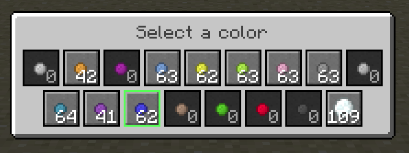

# AE2 More Painting

Adds the ability to paint more AE2 Components to [AE2UEL](https://github.com/AE2-UEL). This may be useful because components with different colors do not connect, even if they are next to eachother.

Components Currently Supported: controller, drive, interface, fluid interface, AE2FC dual interface, IO port, AE2QOLExtras spatial link chamber, CrazyAE improved drive, CrazyAE improved IO port.

Also adds a GUI to the color applicator similar to GTNH's color applicator GUI. Access it by right-clicking air. Additionally, with the color applicator in the offhand, all colorable blocks from this addon will be automatically colored.

Component showcase as of 1.0:

Use case:

Spatial Link Chambers!:

Color Applicator GUI:

## Strange issues with other mods

- Gregtech CEu causes the recolored drives to be invisible, Vintage Fix fixes this

## Dependencies

- [AE2 Unofficial Extended Life](https://github.com/AE2-UEL)- v0.56.7
- [ModularUI](https://github.com/CleanroomMC/ModularUI)- v3.1.6
- Requires MixinBooter

### Optional Dependencies

- [AE2 Fluid Crafting Rework Unofficial](https://github.com/Circulate233/AE2FluidCraft-Rework-Unofficial)- v2.7.10
- [AE2UEL QOL Extras](https://www.curseforge.com/minecraft/mc-mods/ae2uel-qol-extras)- v1.0.1
- [CrazyAE](https://www.curseforge.com/minecraft/mc-mods/crazyae)- v0.6.0.2

### Other Version Compatibility

- I have tested the mod with AE2UEL v0.56.5 and AE2 Fluid Crafting Rework v2.6.6-r and did not find any issues. I do not plan on supporting these versions, but will keep this section updated as I know a lot of modpacks prefer v0.56.5 due to bugs with v0.56.7. Hopefully a new AE2UEL fork comes soon!

## Credits

The idea of colorable controllers, colorable drives, colorable interfaces, and a color applicator GUI is not original, but is ported from [AE2-Unofficial GTNH fork](https://github.com/GTNewHorizons/Applied-Energistics-2-Unofficial/tree/master), which is under LGPL-3.0.

The textures are modified versions of the default [Applied Energistics 2](https://github.com/AppliedEnergistics/Applied-Energistics-2) textures, which is under LGPL-3.0.

The textures of [ae2qolextras](https://github.com/Saugage/ae2uelqolextras) are modified versions from the original mod, under GPL-3.0.

The improved drive textures are modified versions from [CrazyAE](https://github.com/beecupbe/crazyae).

## Development Notes

Parts of the code were written with the help of an AI assistant.